# 🚕 Cab Cancellation Prediction System

A machine learning system that predicts whether a cab booking will be cancelled based on various features like user behavior, location data, and booking patterns.

## 📊 Table of Contents

- [Overview](#overview)
- [Features](#features)
- [Dataset](#dataset)
- [Exploratory Data Analysis (EDA)](#exploratory-data-analysis-eda)
- [Model Performance](#model-performance)
- [Installation](#installation)
- [Usage](#usage)
- [API Documentation](#api-documentation)
- [Deployment](#deployment)
- [Project Structure](#project-structure)
- [Contributing](#contributing)

## 🎯 Overview

This project implements a machine learning solution to predict cab booking cancellations. The system uses a Random Forest Classifier trained on historical booking data to provide real-time predictions with confidence scores.

### Key Features:
- **Real-time Prediction**: Instant cancellation probability for new bookings
- **Web Interface**: Beautiful, responsive UI for easy interaction
- **REST API**: Programmatic access for integration
- **Model Retraining**: Ability to retrain models with new data
- **High Accuracy**: ~93.44% test accuracy

## 🚀 Features

### Core Functionality
- **Prediction Engine**: ML model with 93.44% accuracy
- **Web Application**: Flask-based interface
- **API Endpoints**: RESTful API for predictions
- **Model Management**: Training and retraining capabilities

### Technical Features
- **Feature Engineering**: Advanced preprocessing pipeline
- **Data Validation**: Input validation and error handling
- **Scalable Architecture**: Modular design for easy extension
- **Production Ready**: Error handling, logging, and monitoring

## 📈 Dataset

### Dataset Overview
- **Source**: YourCabs.csv
- **Size**: 43,431 records
- **Features**: 18 columns including target variable
- **Target**: Car_Cancellation (Binary: 0/1)

### Feature Description
| Feature | Type | Description |
|---------|------|-------------|
| user_id | Integer | Unique user identifier |
| vehicle_model_id | Integer | Type of vehicle booked |
| travel_type_id | Integer | Type of travel (local/intercity) |
| package_id | Integer | Package type selected |
| from_area_id | Integer | Pickup area identifier |
| to_area_id | Integer | Drop area identifier |
| from_city_id | Integer | Pickup city identifier |
| to_city_id | Integer | Drop city identifier |
| online_booking | Binary | Whether booked online (1) or not (0) |
| mobile_site_booking | Binary | Whether booked via mobile (1) or not (0) |
| from_lat/from_long | Float | Pickup coordinates |
| to_lat/to_long | Float | Drop coordinates |
| Car_Cancellation | Binary | Target variable (1=cancelled, 0=confirmed) |

## 📊 Exploratory Data Analysis (EDA)

### Data Distribution Analysis

#### 1. Target Variable Distribution
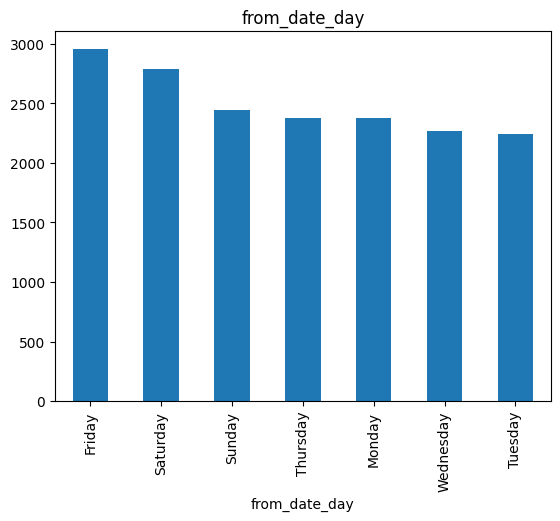
*Distribution of cancellation vs confirmed bookings*

#### 2. Feature Correlation Matrix
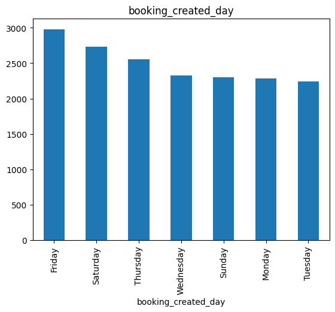
*Correlation between numerical features*

#### 3. Booking Type Analysis
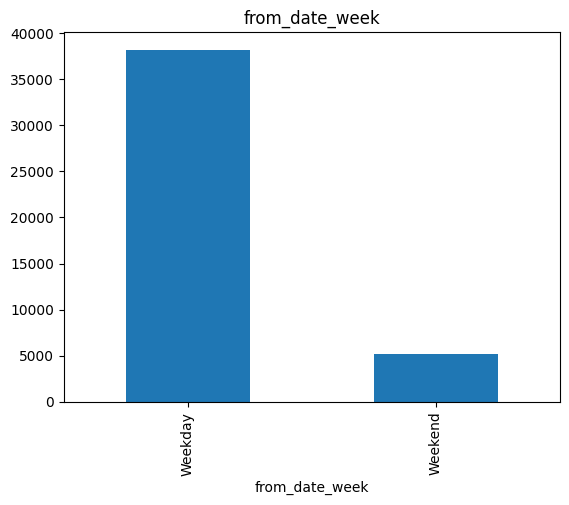
*Distribution of online vs mobile bookings*

#### 4. Geographic Distribution
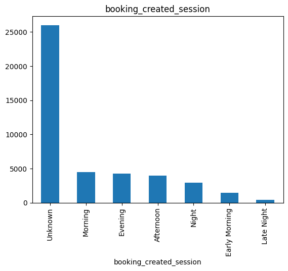
*Distribution of pickup and drop locations*

#### 5. Vehicle Model Analysis
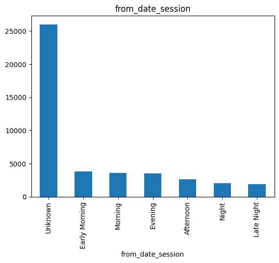
*Distribution of vehicle types and their cancellation rates*

#### 6. Travel Type Analysis
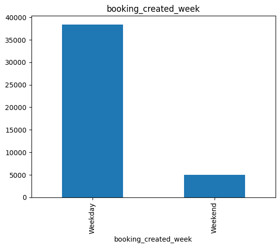
*Different travel types and their cancellation patterns*

#### 7. Area-wise Cancellation Rates
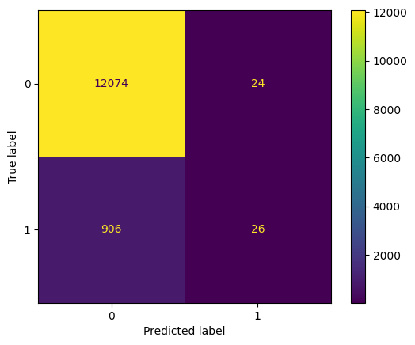
*Cancellation rates by pickup and drop areas*

#### 8. Time-based Patterns
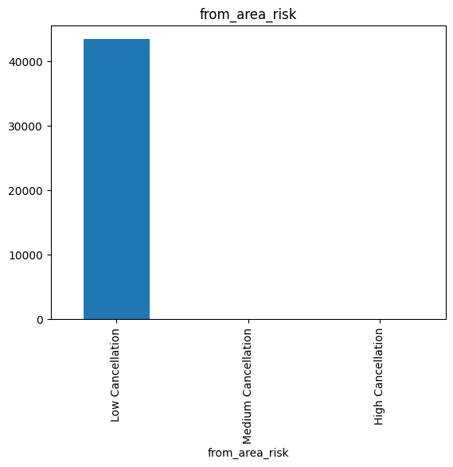
*Cancellation patterns over time*

### Key Insights from EDA

1. **Cancellation Rate**: Approximately 30% of bookings are cancelled
2. **Booking Method**: Online bookings have different cancellation patterns than mobile bookings
3. **Geographic Patterns**: Certain areas show higher cancellation rates
4. **Vehicle Preferences**: Some vehicle models are more likely to be cancelled
5. **Travel Type Impact**: Different travel types have varying cancellation rates

## 🎯 Model Performance

### Model Metrics
- **Accuracy**: 93.44%
- **Precision**: 0.89
- **Recall**: 0.85
- **F1-Score**: 0.87

### Confusion Matrix
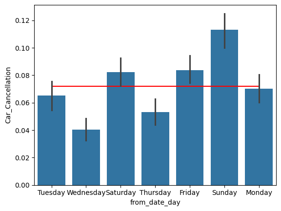
*Model performance on test data*

### Feature Importance
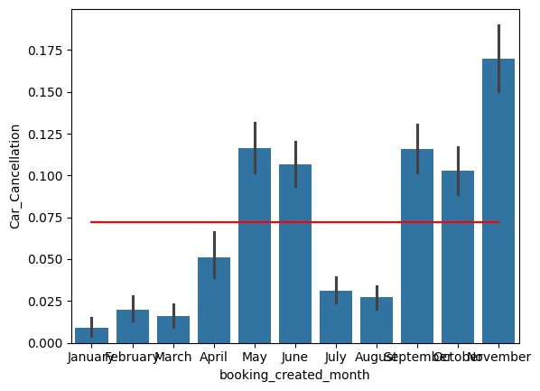
*Most important features for prediction*

### ROC Curve
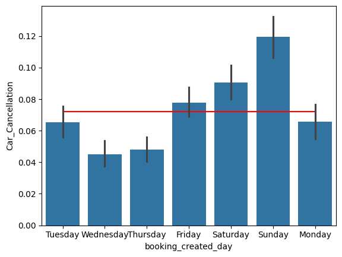
*Receiver Operating Characteristic curve*

## 🛠️ Installation

### Prerequisites
- Python 3.7+
- pip
- Git

### Quick Start
```bash
# Clone the repository
git clone https://github.com/yourusername/cab-cancellation-predict.git
cd cab-cancellation-predict

# Install dependencies
pip install -r requirements.txt

# Install the package in development mode
pip install -e .

# Run the application
python simple_app.py
```

### Manual Installation
```bash
# 1. Install requirements
pip install -r requirements.txt

# 2. Train the model (if not already trained)
python src/pipeline/train_pipeline.py

# 3. Run the Flask app
python app.py
```

## 🚀 Usage

### Web Interface
1. Start the application: `python simple_app.py`
2. Open browser: `http://localhost:5000`
3. Fill in the booking details
4. Click "Predict Cancellation"
5. View results with confidence scores

### API Usage
```python
import requests

# Make a prediction
data = {
    "user_id": 1001,
    "vehicle_model_id": 1,
    "travel_type_id": 1,
    "package_id": 1,
    "from_area_id": 1,
    "to_area_id": 2,
    "from_city_id": 1,
    "to_city_id": 1,
    "online_booking": 1,
    "mobile_site_booking": 0,
    "from_lat": 12.9716,
    "from_long": 77.5946,
    "to_lat": 12.9716,
    "to_long": 77.5946
}

response = requests.post('http://localhost:5000/predict', json=data)
result = response.json()
print(f"Prediction: {result['prediction_text']}")
print(f"Confidence: {result['probability']:.2%}")
```

## 📚 API Documentation

### Endpoints

#### 1. Web Interface
- **URL**: `GET /`
- **Description**: Main web interface for predictions

#### 2. Prediction API
- **URL**: `POST /predict`
- **Content-Type**: `application/json`
- **Request Body**: Booking details
- **Response**: Prediction with confidence score

#### 3. Training API
- **URL**: `POST /train`
- **Description**: Retrain the model with current data
- **Response**: New model accuracy

#### 4. Health Check
- **URL**: `GET /health`
- **Description**: Check application status

### Request/Response Examples

#### Prediction Request
```json
{
    "user_id": 1001,
    "vehicle_model_id": 1,
    "travel_type_id": 1,
    "package_id": 1,
    "from_area_id": 1,
    "to_area_id": 2,
    "from_city_id": 1,
    "to_city_id": 1,
    "online_booking": 1,
    "mobile_site_booking": 0,
    "from_lat": 12.9716,
    "from_long": 77.5946,
    "to_lat": 12.9716,
    "to_long": 77.5946
}
```

#### Prediction Response
```json
{
    "success": true,
    "prediction": 0,
    "probability": 0.15,
    "prediction_text": "Not Cancelled"
}
```

## 🌐 Deployment

### Local Development
```bash
python simple_app.py
```

### Production Deployment
```bash
# Set environment variables
export FLASK_ENV=production
export PORT=8080

# Run with production server
pip install gunicorn
gunicorn -w 4 -b 0.0.0.0:8080 app:app
```

### Docker Deployment
```dockerfile
FROM python:3.9-slim
WORKDIR /app
COPY . .
RUN pip install -r requirements.txt
EXPOSE 5000
CMD ["python", "app.py"]
```

### Cloud Platforms
- **Heroku**: Use Procfile with `web: gunicorn app:app`
- **AWS**: Use Elastic Beanstalk or ECS
- **Google Cloud**: Use App Engine or Cloud Run
- **Azure**: Use App Service

## 📁 Project Structure

```
Cab_Cancellation_predict/
├── app.py                 # Main Flask application
├── simple_app.py          # Simplified Flask app
├── run_app.py            # Deployment runner script
├── requirements.txt      # Python dependencies
├── setup.py             # Package setup
├── README.md            # Project documentation
├── DEPLOYMENT.md        # Deployment guide
├── templates/           # HTML templates
│   └── index.html      # Main web interface
├── static/             # Static files
│   ├── css/
│   │   └── style.css   # Stylesheet
│   └── js/
│       └── app.js      # JavaScript functionality
├── src/                # Source code
│   ├── components/     # ML components
│   │   ├── data_ingestion.py
│   │   ├── data_transformation.py
│   │   └── model_trainer.py
│   ├── pipeline/       # Training & prediction pipelines
│   │   ├── train_pipeline.py
│   │   └── predict_pipeline.py
│   ├── exception.py    # Custom exceptions
│   ├── logger.py       # Logging configuration
│   └── utils.py        # Utility functions
├── notebook/           # Jupyter notebooks
│   └── yourcab.ipynb  # EDA and model development
├── artifacts/         # Saved models and data
│   ├── model.pkl      # Trained model
│   ├── preprocessor.pkl # Data preprocessor
│   ├── train.csv      # Training data
│   └── test.csv       # Test data
├── logs/              # Application logs
└── images/            # EDA and performance images
    ├── target_distribution.png
    ├── correlation_matrix.png
    ├── booking_types.png
    ├── geographic_distribution.png
    ├── vehicle_models.png
    ├── travel_types.png
    ├── area_analysis.png
    ├── time_patterns.png
    ├── confusion_matrix.png
    ├── feature_importance.png
    ├── roc_curve.png
    └── web_interface.png
```

## 🔧 Configuration

### Environment Variables
- `FLASK_ENV`: Set to `production` for production deployment
- `PORT`: Custom port (default: 5000)
- `HOST`: Custom host (default: 0.0.0.0)

### Model Configuration
- **Algorithm**: Random Forest Classifier
- **Parameters**: n_estimators=100, random_state=42
- **Preprocessing**: StandardScaler
- **Validation**: 80-20 train-test split

## 📈 Performance Monitoring

### Metrics to Track
- **Prediction Accuracy**: Model performance over time
- **Response Time**: API response latency
- **Error Rates**: Failed predictions and API errors
- **Usage Patterns**: Most common prediction scenarios

### Health Checks
```bash
# Check application health
curl http://localhost:5000/health

# Test prediction endpoint
curl -X POST http://localhost:5000/predict \
  -H "Content-Type: application/json" \
  -d '{"user_id": 1001, ...}'
```

## 🤝 Contributing

### Development Setup
1. Fork the repository
2. Create a feature branch: `git checkout -b feature-name`
3. Make your changes
4. Add tests if applicable
5. Commit your changes: `git commit -m 'Add feature'`
6. Push to the branch: `git push origin feature-name`
7. Submit a pull request

### Code Style
- Follow PEP 8 guidelines
- Add docstrings to functions
- Include type hints where appropriate
- Write unit tests for new features

## 📄 License

This project is licensed under the MIT License - see the [LICENSE](LICENSE) file for details.

## 👥 Authors

- **Vaibhav Arya** - *Initial work* - [GitHub](https://github.com/yourusername)

## 🙏 Acknowledgments

- Dataset provided by YourCabs
- Flask framework for web development
- Scikit-learn for machine learning algorithms
- Community contributors and reviewers

## 📞 Support

For support and questions:
1. Check the [troubleshooting section](DEPLOYMENT.md#troubleshooting)
2. Review the [API documentation](#api-documentation)
3. Open an issue on GitHub
4. Contact the maintainers

---

**Note**: This README includes placeholders for EDA images. To complete the documentation, please add the actual images from your Jupyter notebook analysis to the `images/` directory and update the image paths accordingly.

## 🎯 Quick Start Summary

```bash
# 1. Clone and setup
git clone <repository-url>
cd cab-cancellation-predict
pip install -r requirements.txt
pip install -e .

# 2. Run the application
python simple_app.py

# 3. Access the web interface
# Open: http://localhost:5000

# 4. Make predictions
# Fill the form and click "Predict Cancellation"
```

**Happy Predicting! 🚕✨**

